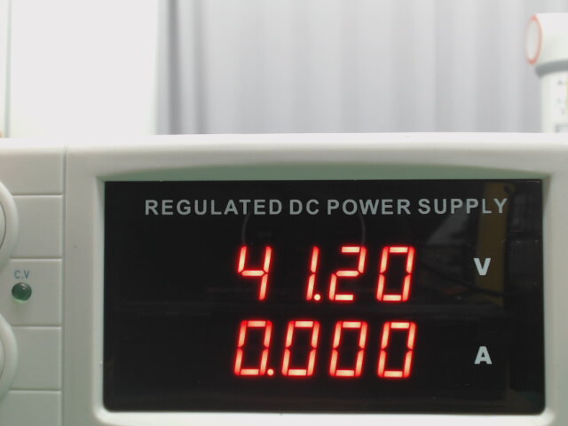
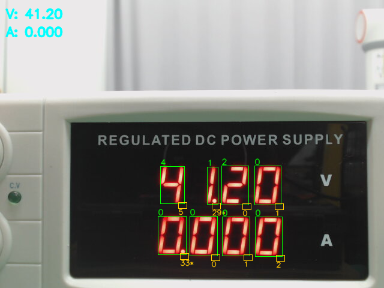

# CommonClaude

**Project-wide conventions for all Claude Code sessions**

This repository defines the rules and workflows that every [Claude Code](https://claude.ai/code) session must follow. The core document is [`CommonClaude.md`](CommonClaude.md).

---

## Environment

| Item       | Detail                                 |
|------------|----------------------------------------|
| Runtime    | Docker container (`--privileged`)      |
| OS         | Ubuntu 24.04 (Noble)                   |
| Dev tool   | Claude Code (CLI / VS Code extension)  |

---

## Convention Summary

### 1. MIT Code Convention

Follows the [MIT CommLab Coding and Comment Style](https://mitcommlab.mit.edu/broad/commkit/coding-and-comment-style/).

| Element  | Style        | Example            |
|----------|--------------|--------------------|
| Variable | `lower_case` | `joint_angle`      |
| Function | `lower_case` | `send_action`      |
| Class    | `CamelCase`  | `FairinoFollower`  |
| Constant | `lower_case` | `_settle_mid_s`    |
| Module   | `lowercase`  | `fairino_follower`  |

- 80-column limit, 4-space indentation
- Google-style docstrings required (`Args:`, `Returns:`, `Raises:`)
- All comments, docstrings, and documentation must be in **English**
- TODO format: `# TODO: (@owner) description`

### 2. Debug File Management

| Location        | Purpose                                     |
|-----------------|---------------------------------------------|
| `tests/`        | Production-quality tests for CI/CD          |
| `claude_test/`  | Debug scripts, one-off experiments          |

### 3. Task Management

Every task follows this workflow:

1. **Validate input** — Check if the command is explicit and if reference materials exist
2. **Write ToDo.md** — Organize the task list
3. **User confirmation** — Get approval on ToDo.md contents
4. **Create GitHub issue** — Register via `gh issue create`
5. **Execute** — Check off completed items in ToDo.md
6. **Update issue** — Sync progress via `gh issue edit`

### 4. Testing Rules

- **No magic numbers** — Use meaningful constants instead of unexplained values
- **No hardcoding** — Never write code that only passes specific test inputs
- **Code quality first** — Prioritize readability, maintainability, and correctness over passing tests

### 5. Using `ultrathink`

When in **plan mode** or tackling **complex tasks**, append `ultrathink` to the end of your command. This signals Claude to use extended reasoning for deeper analysis.

```
# Example
Review this entire codebase ultrathink
```

---

## Automated Enforcement (Hooks)

This repository uses [Claude Code hooks](https://code.claude.com/docs/en/hooks) to automatically enforce the conventions above. Hooks run on every tool call matching their event and either block the action or feed errors back to Claude for self-correction.

| Hook Script | Event | Rule Enforced | Behavior |
|---|---|---|---|
| [`pre-write-guard.sh`](.claude/hooks/pre-write-guard.sh) | PreToolUse (Write/Edit) | §2 Debug File Management | **Blocks** writing `debug_*`, `scratch_*`, `tmp_*`, `experiment_*` files into `tests/` |
| [`post-write-lint.sh`](.claude/hooks/post-write-lint.sh) | PostToolUse (Write/Edit) | §5 Linting | Runs `ruff check` + `ruff format --check` on every Python file write; **feeds errors back** to Claude |
| [`post-write-debug-remind.sh`](.claude/hooks/post-write-debug-remind.sh) | PostToolUse (Write/Edit) | §2 Debug File Management | Reminds to update `claude_test/README.md` when adding files to `claude_test/` |
| Stop prompt hook | Stop | §3 Task Management | Verifies that `ToDo.md` has an entry and a GitHub issue exists before Claude finishes |

Configuration lives in [`.claude/settings.json`](.claude/settings.json), and the linter is configured by [`ruff.toml`](ruff.toml) (80-column, 4-space, rules `E/F/W/I/N`).

**Not enforced via hooks** (kept in `CLAUDE.md` as instructions): comment quality, English-only rule, magic-number/hardcoding rules, and command input validation — these require human judgment.

---

## Claude Code IDE Commands

| Command            | Description                                         |
|--------------------|-----------------------------------------------------|
| `/clear`           | Clears Claude's memory context.                     |
| `/rewind`            | Re-executes the previous action.                  |
| `/memory`          | Adds specific content to memory.                    |
| `/permission`      | Configures permissions for Bash, Edit, Write, etc.  |
| `/review`          | Checks the current session's context cost.          |
| `/output-style`    | Switches the output style (Default, Explanatory, Learning) or applies a custom style. |

---

## Claude Code Shortcuts (VS Code)

| Shortcut                     | Description                                      |
|------------------------------|--------------------------------------------------|
| `Shift` + `Tab`              | Toggles approval mode.                           |
| `Ctrl` + `Shift` + `E`       | Opens the Explorer panel.                        |
| `Ctrl` + `Shift` + `X`       | Opens the Extensions panel.                      |
| `Alt` + `K`                  | Starts an inline editor reference.               |


---

## Cowork Session Rules (`CLAUDECowork.md`)

[`CLAUDECowork.md`](CLAUDECowork.md) defines rules specific to the Cowork workspace session.

### Expense Report Preparation

Rules for writing research expense reports under `서류 작업/`:
- Extract item names, quantities, amounts, and dates from transaction statements, quotes, and card receipts (PDF)
- Fields to update: date, amount (formatted as `"315,000 원"`), usage details (`"{item} 외 {count}건"`)
- Protected fields (names, budget codes, affiliations) must not be changed
- Verify against source PDFs after completion, then back up to the designated archive path

### ToDo Workflow

- Write a new entry in `ToDo.md` **before** starting any task (append only, never delete)
- Get user approval before executing
- Check off items as they are completed; keep all history intact

### Mail Reply Rules

- Use `DocumentMailReply.md` as the reply template
- Replace the `{friendly name}` placeholder with the sender's first name
- Always show the draft to the user and get approval **before** sending

---

## 7-Segment Display Reader (`7segment_reader.py`)

Reads voltage and current from a regulated DC power supply that has a two-row red 7-segment display. Given an image, the reader emits the V row and A row both as raw strings (with the decimal point) and as parsed `float` values.

```bash
python 7segment_reader.py SegmentTest/2026-04-27-165316.jpg
# {"V_raw": "41.20", "A_raw": "0.000", "V": 41.2, "A": 0.0}
```

Add `--debug` to dump the intermediate masks and the decoded overlay into `./debug/`.

### Pipeline (illustrated on `SegmentTest/2026-04-27-165316.jpg`)

#### 1. Input

The display in the photo shows V = 41.20 and A = 0.000. The LED segments are bright enough that the camera saturates their centres, while the room behind the panel adds white reflections.



#### 2. Red purity score → STRICT mask + small-hole fill

For each pixel the reader computes `red_score = R − max(G, B)`. Pure red is large positive, white room reflections are near zero, and black panel area is zero — so the score isolates the LED light without any explicit colour space conversion.

Thresholding at `score > 100` gives a clean digit mask, but at saturated segment centres `R = G = B ≈ 255` makes `red_score ≈ 0`, so each segment renders as a *hollow ring*. A small-hole fill (`fill_small_holes`, ≤ 200 px enclosed components) seals these saturation voids without touching the genuine off-segment interior of digit 0 (~700–940 px) or the upper/lower halves of digit 8 (~240–340 px).


#### 3. LOOSE mask (`score > 60`)

A second, more permissive mask is kept hollow — it is used only for decimal-point detection. Hole-filling here would risk merging the dot with segment c's saturation void.


#### 4. Connected-component blobs and row clustering

8-connectivity components on the strict mask, filtered by `height ≥ 40` and `area ≥ 300`, give exactly the eight digit blobs (the small "C.V" indicator and the V / A row labels are dropped automatically). Sorting their Y-centres and splitting at the largest gap separates the V row from the A row; each row is then sorted left-to-right.

#### 5. Italic-aware segment sampling

Each digit bounding box is checked against an aspect-ratio shortcut (`w / h < 0.35` ⇒ `"1"`). Otherwise seven sample regions, one per segment a–g, are tested against the strict mask:

```text
 a (top)            (0.30, 0.00, 0.70, 0.18)
 b (top-right)      (0.78, 0.08, 1.00, 0.45)
 c (bottom-right)   (0.78, 0.55, 1.00, 0.92)
 d (bottom)         (0.30, 0.82, 0.70, 1.00)
 e (bottom-left)    (0.00, 0.55, 0.22, 0.92)
 f (top-left)       (0.00, 0.08, 0.22, 0.45)
 g (middle)         (0.30, 0.42, 0.70, 0.58)
```

The display font has ≈ 14° italic slant (`ITALIC_SLANT = 0.25`), so axis-aligned rectangles would miss the bottom of segment c and let it bleed into segment d:

- **Vertical segments (b, c, e, f)** — each row of the sample region is sheared by `slant × (h/2 − y)`, forming a parallelogram that tracks the slanted vertical stroke.
- **Horizontal segments (a, d, g)** — the bar itself stays horizontal in italic; the entire rectangle is *translated* by the slant computed at the segment's vertical centre. This avoids a segment-c-bottom false positive on segment d (which previously turned `7` into `?`).

A segment is ON when its lit-pixel ratio is at least `ON_THRESHOLD = 0.28`, comfortably below segments that should fire (typically 0.4–1.0) yet above bleed-in (typically ≤ 0.20). The 7-tuple is then looked up in `SEGMENT_TO_DIGIT`; an unknown pattern returns `?`.

#### 6. Decimal point

For each digit, a 14 × 10 probe at the lower-right corner counts loose-mask pixels. The row's maximum count is taken to mark the dot-bearing digit, gated by:

- `max ≥ DOT_MIN_ABS (= 12)` — absolute floor (no row-wide hallucination)
- `max ≥ DOT_RATIO_OVER_MEDIAN (= 1.5) × median` — the dot must stand out from the rest of the row

A `.` is then inserted *after* the matching digit. The 1.5× factor is below the obvious 2.0× because italic segment-c tails creep into the other digits' probe windows and inflate the median.

#### 7. Final overlay

Green boxes are detected digits with their decoded character; orange boxes are decimal probes with their pixel counts (the starred count marks the dot insertion point). The cyan caption at the top-left echoes the assembled raw strings.



### Accuracy on the `SegmentTest/` folder

Evaluated against a hand-labelled ground truth via [`claude_test/eval_segmenttest.py`](claude_test/eval_segmenttest.py); per-image results are in [`segmenttest_results.csv`](segmenttest_results.csv).

| Metric | Result |
|---|---|
| V row exact match | 29 / 30 (96.7%) |
| A row exact match | 28 / 30 (93.3%) |
| Both rows | 27 / 30 (90.0%) |

The remaining failures are all italic-segment-c bleed cases on digit 7.

---

## References

- Full rules: [`CommonClaude.md`](CommonClaude.md)
- Cowork rules: [`CLAUDECowork.md`](CLAUDECowork.md)
- Debug file index: [`claude_test/README.md`](claude_test/README.md)
- [ClaudeCode for vscode](https://code.claude.com/docs/en/vs-code#extension-settings)
- [클로드 코드를 활용한 바이브 코딩 완벽입문](https://product.kyobobook.co.kr/detail/S000219349783)
- [한 걸음 앞선 개발자가 지금 꼭 알아야할 클로드 코드](https://product.kyobobook.co.kr/detail/S000217402731)  
